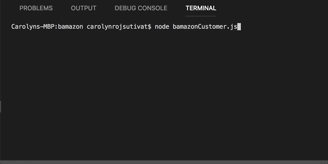

# bamazon
an Amazon-like storefront with MySQL. The app will take in orders from customers and deplete stock from the store's inventory. As a bonus task, you can program your app to track product sales across your store's departments and then provide a summary of the highest-grossing departments in the store.

## Demo & Screenshots

Initializing

Making a purchase

## Tech/framework used

<b>Built with</b>
- [Node.js](https://nodejs.org/en/)
- [MySQL](https://www.mysql.com/)

## License

Northwestern University © [Carolyn Rojsutivat]()